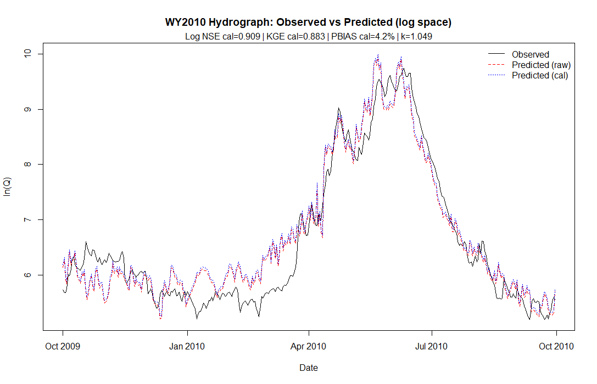

YAMPA RIVER DAILY STREAMFLOW MODEL

INTRO

The goal of this project is to predict daily streamflow hydrographs at the Yampa River gauge at Deerlodge 
Park (USGS 09260050). The model was calibrated using data from water years 2004-2024, and validated on 
several water years held out of sample. 

REPOSITORY STRUCTURE/INSTRUCTIONS

This model can be entirely reproduced using the code within /scripts. The .js Google Earth Engine script, given a 
drainage basin geometry (can be easily pulled from https://streamstats.usgs.gov/ss/?gage=09260050&tab=info)
will export a CSV containing all necessary meteorological and snowpack data for the model, averaged across the basin or specified elevation band for SWE data. Other 
necessary data can be downloaded as daily average stream flow volume from https://waterdata.usgs.gov/monitoring-location/USGS-09260050/.

The data is also uploaded exactly as exported for water years 2004-2024 in the repository if that is 
preferable. Within the R script, simply update file paths and run. Lines 386-389 have the holdout years 
to test, those can be edited by simply changing the water year specified and the surrounding references 
(all things you need to change are right at the end). No changes to the downloaded .csv's are necessary 
and will likely do more harm than good. The R program is designed to run with the files exactly as 
downloaded from GEE and USGS.

MODEL

This linear regression model predicts log CFS using:
    -7 day change in snowpack (dSWE) across three equal area elevation bands in the Yampa River 
    basin (calculated within GEE code)
    
    -melt energy through positive degree days (PDD) and solar radiation (srad_w2)

    -rain, rain on snow flagging, and antecedent precipitation index (API)

    -Seasonal timing VIA DOY average cfs, sin(DOY)

    -Interaction term: dSWE x PDD to approximate energy-limited melt processes

The included R program will build the model and run predicted vs observed for 4 seperate years.
When predicted vs observed is run, it specifically holds the specified test year out of sample and 
recalculates the model to avoid leakage. 

For each year reported, the program will calculate: 
    Nash-Suttcliffe Efficiency(NSE)
    Kling-Gupta Efficiency(KGE)
    Log-space RMSE
    PBIAS as a seasonal volume
    Volume ratio predicted vs. observed

  The graph will display as such:

  
LIMITATIONS

Being a snowmelt-dominant basin, the Yampa River is reliant on April-June freshet pulses 
for its peak streamflow each year. The most extreme years show that high water years (2023) 
can prove challenging in terms of predicting the full magnitude of the spring melt pulse. 
In contrast, low snowpack years with anomalous runoff efficiency (2012) show that this model 
does not account for the important predictors for dry years. However, for most typical snowpack 
years, this model performs excellently with KGE and NSE close to or above 0.9, and PBIAS close to 
+-10% after volume correction. 

